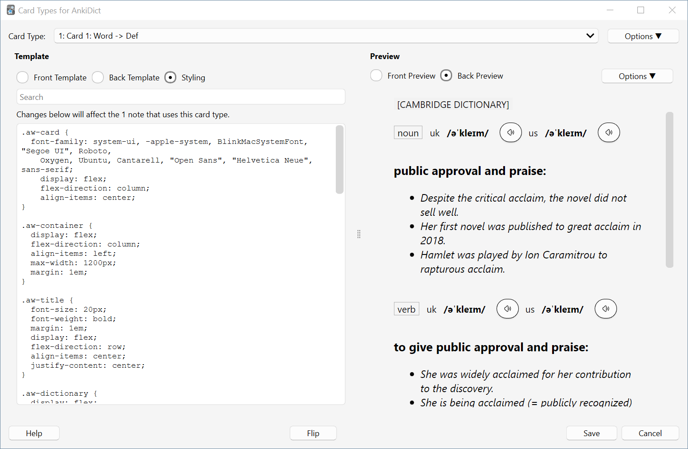

# Anki Word Wizard Template

A template for Anki by [Anki Word Wizard](https://ankiwords.xyz).

## Example

An example of our nicely designed card template.

## Usage

### Option 1. Use the template directly on any front/back card

1. Open Card Template Editor by clicking "Cards..." button in the card editor.
2. Put the content of `front.html` into "Front Template",  `back.html` into "Back Template", and `styling.css` into "Styling". See the [Screenshots](#Screenshots) below.
3. Click "Save" and close the editor.

### Option 2. Import `AnkiDict Demo.apkg` file

1. Download [AnkiDict Demo.apkg](./AnkiDict%20Demo.apkg).
2. Import the file into Anki.
3. `AnkiDict` card type is now available in Anki. You can check "Note Types" after clicking "Browse" button on the main panel.
4. You can now delete the imported deck.

## Screenshots

### Front Template

### Back Template

### Styling

